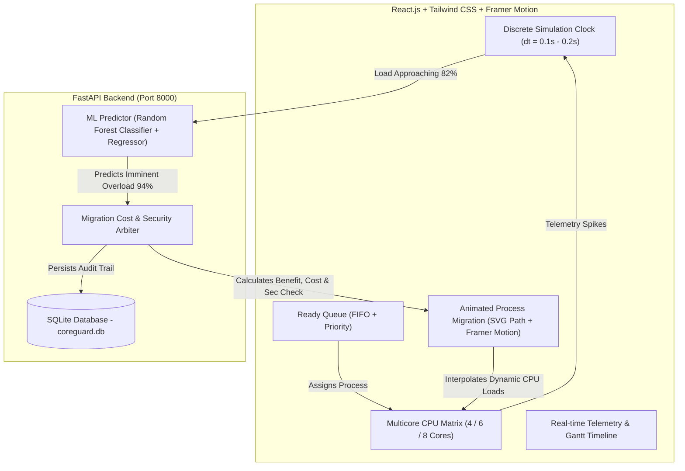

# CoreGuard: Predictive Security-Aware Dynamic Process Migration and Intelligent Load Balancing in Multicore Cloud Computing Environments

> **Educational Systems Disclaimer**: The project simulates multicore process/workload scheduling and migration at the application level. CPU utilization, migration cost, cache penalty, and memory penalty are modeled/estimated for educational demonstration. The project does not replace the operating system kernel scheduler.

---

## 1. Project Overview & Problem Statement

Modern cloud computing platforms host multi-tenant workloads across high-density multicore processors (4, 6, 8, 16+ physical/logical cores). Traditional operating system schedulers (such as Linux Completely Fair Scheduler / CFS or reactive load balancers) typically operate **reactively**:
1. Workload spikes occur on a core.
2. The core becomes 95%+ saturated or thermally throttled.
3. The scheduler detects the imbalance retroactively.
4. Processes are forcibly migrated to cold cores without assessing cache state, memory copy penalties, or co-tenancy security vulnerabilities.

This reactive paradigm leads to:
- **Severe Tail Latency Spikes**: Systems experience performance degradation while reacting to saturation.
- **Cache Invalidation Overhead**: Moving cache-heavy processes across core domains empties L1/L2 caches.
- **Security & Co-Tenancy Hazards**: Blind load balancers may co-locate sensitive cryptographic/payment workloads alongside untrusted or compromised multi-tenant guests, opening side-channel vulnerabilities (e.g., Spectre/Meltdown L1TF cache snooping).
- **Process Thrashing / Ping-Pong**: Reactive migrations often overload the destination core, forcing oscillations back and forth.

**CoreGuard** solves this by introducing a **Predictive, Security-Aware Dynamic Process Migration & Load Balancing Architecture**. CoreGuard combines:
- Machine Learning (Random Forest) for **early overload prediction** based on telemetry trends.
- A **multi-attribute migration cost function** incorporating memory transfer latency, cache warmness penalties, and security classifications.
- Strict **co-tenancy isolation policies** ensuring sensitive workloads are never scheduled alongside untrusted neighbors.
- An **interactive, physics-inspired visual multicore OS simulator** where processes physically move across animated SVG vector conduits between CPU cores in real time.

---

## 2. Architecture & System Flow



---

## 3. Technology Stack

- **Frontend**: React.js 19, Tailwind CSS v4, Framer Motion (animated vector migration), Lucide Icons
- **Visualization**: Scalable Vector Graphics (SVG) dynamic conduit paths, Recharts telemetry charts
- **Simulation Engine**: Pure JavaScript discrete-event scheduler with deterministic clock and state machine
- **Machine Learning**: Python 3.14+, Scikit-Learn (`RandomForestClassifier` + `RandomForestRegressor`), Pandas, NumPy, Joblib
- **Backend API**: FastAPI, Uvicorn, Pydantic v2
- **Persistent Storage**: SQLite 3 (`database/coreguard.db`)

---

## 4. Key Mathematical Formulations

### A. Explainable Multi-Attribute Migration Cost
When a core approaches capacity, candidate processes on that core are evaluated using:

$$\text{Migration Cost} = \alpha \times T_{\text{mig}} + \beta \times P_{\text{mem}} + \gamma \times P_{\text{cache}} + \delta \times P_{\text{sec}}$$

Where:
- $\alpha, \beta, \gamma, \delta$: Tunable sensitivity weights (configurable via live UI sliders).
- $T_{\text{mig}}$: Estimated memory transfer time proportional to working set size:
  $$T_{\text{mig}} = \frac{\text{Memory (MB)}}{100.0} \times 0.90\text{ seconds}$$
- $P_{\text{mem}}$: Memory footprint disruption penalty:
  $$P_{\text{mem}} = \frac{\text{Memory (MB)}}{80.0} \times 1.40$$
- $P_{\text{cache}}$: L1/L2 cache warmness penalty:
  - $\text{HIGH} = 3.4$
  - $\text{MEDIUM} = 2.0$
  - $\text{LOW} = 0.8$
- $P_{\text{sec}}$: Security classification penalty:
  - $\text{UNTRUSTED} = 3.0$
  - $\text{SENSITIVE} = 1.5$
  - $\text{TRUSTED} = 0.0$

### B. Expected Benefit & Net Migration Score
$$\text{Expected Benefit} = \text{Load}_{\text{source, before}} - \text{Expected Load}_{\text{source, after}} = \text{cpuDemand}$$

$$\text{Migration Score} = \text{Expected Benefit} - \text{Migration Cost}$$

**Decision Rule**:
A process is approved for migration **if and only if**:
1. $\text{Migration Score} \ge \tau$ (configured threshold, default $+4.0$).
2. Target Core Security Policy passes ($\text{SecurityCheck} = \text{PASS}$).
3. Target Core has sufficient remaining capacity ($\text{Load}_{\text{dest}} + \text{Demand} \le 88\%$).

---

## 5. Security & Co-Tenancy Isolation Model

Processes carry one of three security classifications:
1. **TRUSTED**: Certified OS tasks and internal microservices. May co-locate freely.
2. **SENSITIVE**: Cryptographic signing, user credentials, financial transactions. **Strictly forbidden** from sharing hardware execution cores with untrusted guests.
3. **UNTRUSTED**: Sandboxed user code, external batch jobs. Strictly isolated from sensitive domains.

If a candidate is `SENSITIVE` and a destination core has an `UNTRUSTED` process, the destination is marked **`BLOCKED`**, and another candidate core is evaluated.

---

## 6. Live Animated Migration

Unlike static dashboards that simply delete a card and render it elsewhere, CoreGuard computes an **SVG quadratic bezier curve** between the source and target cores:
- The process card visibly glides along the trajectory from Core $X$ to Core $Y$.
- A glowing particle conduit pulsates along the vector path.
- As migration progress advances from $0\%$ to $100\%$, CPU loads interpolate smoothly:
  - Source load: decreases proportionally to $(1 - \text{progress}) \times \text{Demand}$.
  - Target load: increases proportionally to $\text{progress} \times \text{Demand}$.
- The user can **pause** the simulation halfway through migration and inspect in-flight states!

---

## 7. Machine Learning Overload Prediction

- **Model**: `RandomForestClassifier` (for binary overload classification) and `RandomForestRegressor` (for continuous projected load).
- **Features**:
  1. `current_load` (0 - 100%)
  2. `prev_load` (0 - 100%)
  3. `moving_avg` (0 - 100%)
  4. `trend` (slope $\Delta L / \Delta t$)
  5. `process_count` (active processes on core)
  6. `avg_process_load`
- **Output**: Overload probability, confidence percentage, projected CPU load in 3-5 ticks.

---

## 8. Database Schema (`coreguard.db`)

CoreGuard uses SQLite with the following schema:
- `simulation_runs`: Run ID, mode, core count, status, timestamps.
- `processes`: Process metadata, arrival times, CPU demand, memory, cache, security levels.
- `migration_events`: Audit log of all completed migrations, cost vectors, benefit scores, source/target loads.
- `prediction_results`: ML inference telemetry logs (features, confidence, predicted load).
- `performance_metrics`: Comparative benchmark records for Reactive vs Predictive executions.

---

## 9. API Reference (FastAPI)

| Method | Endpoint | Description |
|---|---|---|
| `GET` | `/api/health` | Service and ML model health check |
| `POST` | `/api/predict` | Executes Random Forest overload prediction on core telemetry |
| `POST` | `/api/migration/analyze` | Evaluates candidates, computes multi-attribute costs, and checks security |
| `POST` | `/api/migration/execute` | Persists an executed migration event to SQLite |
| `GET` | `/api/migrations` | Retrieves recent migration audit trail |
| `POST` | `/api/simulation/start` | Registers a new simulation run |
| `POST` | `/api/simulation/reset` | Resets simulation telemetry |
| `POST` | `/api/simulation/run-demo`| Fetches deterministic demo script |
| `GET` | `/api/performance` | Returns comparative benchmark data vs Reactive baseline |

---

## 10. How to Run the Project

### Prerequisites
- Node.js 18+ and npm
- Python 3.10+ (tested on Python 3.14)

### Running the Backend (FastAPI)
```bash
cd coreguard/backend

# Optional: Create virtual environment
python -m venv venv
# Windows:
venv\Scripts\activate
# Linux/Mac:
# source venv/bin/activate

# Install dependencies
pip install -r requirements.txt

# Train ML model (creates ml/model.pkl)
python ml/train.py

# Start FastAPI server
uvicorn main:app --reload --port 8000
```
API Documentation will be live at: `http://localhost:8000/docs`

### Running the Frontend (React.js)
```bash
cd coreguard/frontend

# Install npm packages
npm install

# Start Vite development server
npm run dev
```
Open your browser at: `http://localhost:5173`

---

## 11. Deterministic Demonstration Scenario

Click **`[RUN COMPLETE DEMO]`** on the top navigation bar to watch the complete end-to-end OS sequence:
1. **0.0s**: $P_1$ arrives $\rightarrow$ Assigned to Core 0.
2. **2.0s**: $P_2$ arrives $\rightarrow$ Assigned to Core 1.
3. **4.0s**: $P_3$ arrives $\rightarrow$ Assigned to Core 2.
4. **6.0s**: $P_4$ arrives $\rightarrow$ Assigned to Core 1.
5. **8.0s**: $P_5$ arrives (SENSITIVE) $\rightarrow$ Assigned to Core 1.
6. **10.0s**: Core 1 load approaches $86\%$ overload risk.
7. **12.0s**: Random Forest ML model predicts $94\%$ overload imminent.
8. **14.0s**: Candidates ($P_2, P_4, P_5$) are evaluated.
9. **15.0s**: Migration cost vector is calculated ($P_5$ score: $+17.5$).
10. **16.0s**: Security co-tenancy policy checked (Core 3 untrusted $\rightarrow$ blocked; Core 2 compatible $\rightarrow$ passed).
11. **17.0s**: $P_5$ selected for migration to Core 2.
12. **18.0s**: **Animated migration begins**: $P_5$ physically glides along an SVG trajectory from Core 1 to Core 2.
13. **20.0s**: Core 1 drops to $69\%$ while Core 2 absorbs to $57\%$.
14. **21.0s**: Event committed to SQLite; comparative performance telemetry is shown.

---

## 12. Limitations & Educational Scope

- **Application-Level Emulation**: This software is an educational simulator designed for visual demonstration and academic evaluation; it does not patch the host OS kernel scheduler (Linux CFS / Windows NT Kernel).
- **Hardware Abstraction**: Memory and cache penalties are modeled using mathematical formulas rather than hardware PMU (Performance Monitoring Unit) cycle counters.
